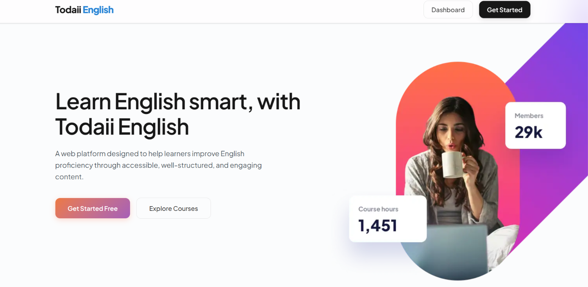
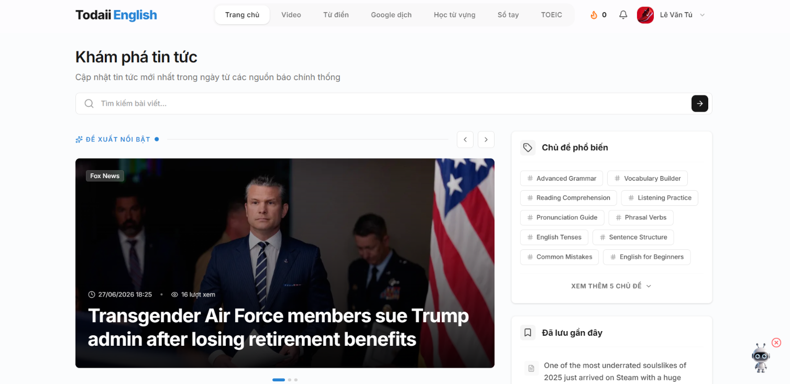
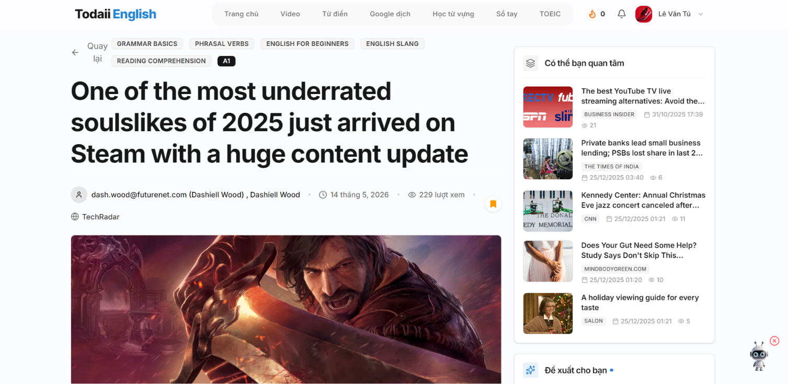
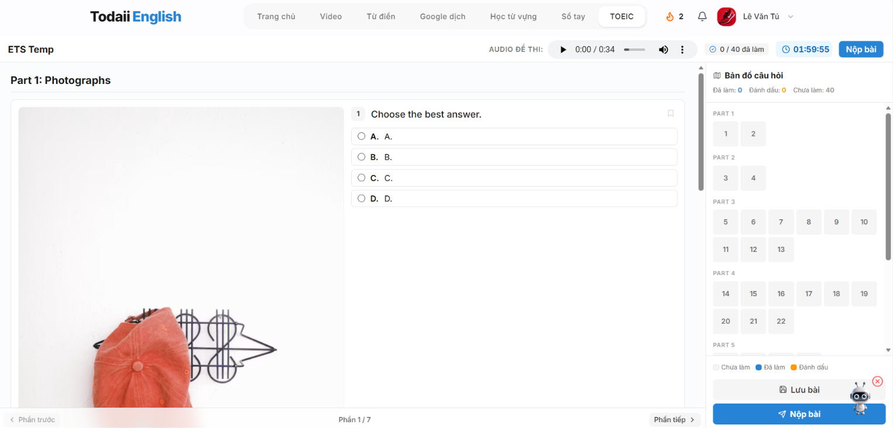
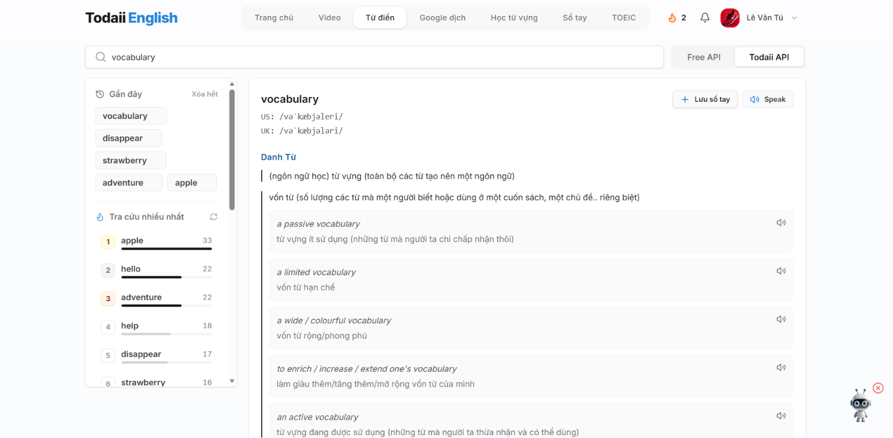
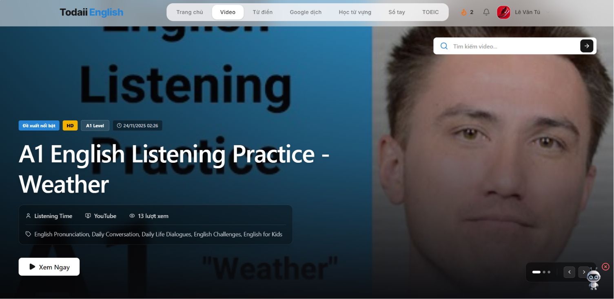
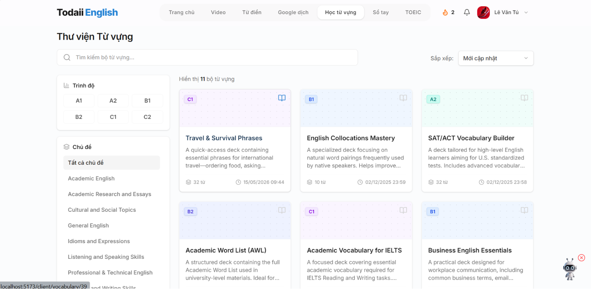
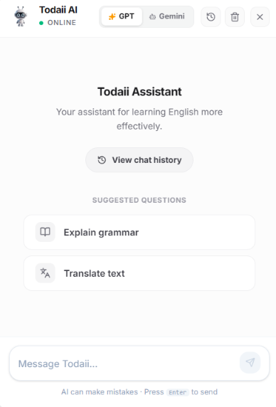
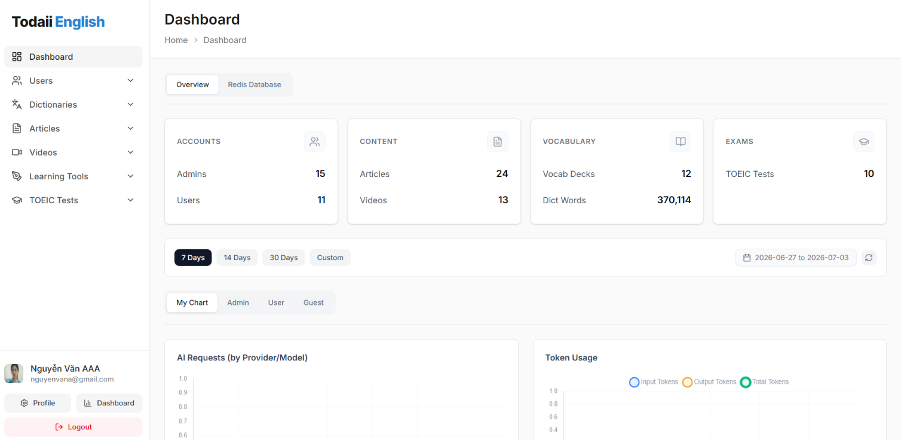

# 📘 Todaii English — Frontend

**The React-based frontend for the Todaii English e-learning platform.**  
Connects to a Spring Boot backend via REST APIs to deliver TOEIC exam preparation, AI-powered study coaching, dictionary lookup, video-based learning, and a full admin content management system.

<p align="center">
  
  
  
  
</p>

---

## 🛠 Tech Stack

| Category               | Technology                                                                                | Version    |
| ---------------------- | ----------------------------------------------------------------------------------------- | ---------- |
| **UI Library**         | [React](https://react.dev/)                                                               | 19.1       |
| **Build Tool**         | [Vite](https://vitejs.dev/)                                                               | 7.1        |
| **Language**           | JavaScript (ES6+)                                                                         | —          |
| **Routing**            | [React Router](https://reactrouter.com/)                                                  | 7.9        |
| **Styling**            | [Tailwind CSS](https://tailwindcss.com/)                                                  | 4.1        |
| **HTTP Client**        | [Axios](https://axios-http.com/)                                                          | 1.13       |
| **State Management**   | [Zustand](https://zustand-demo.pmnd.rs/)                                                  | 5.0        |
| **Animations**         | [Framer Motion](https://www.framer.com/motion/)                                           | 12.x       |
| **Icons**              | [Lucide React](https://lucide.dev/)                                                       | 0.552      |
| **Charts**             | [Chart.js](https://www.chartjs.org/) + [react-chartjs-2](https://react-chartjs-2.js.org/) | 4.5 / 5.3  |
| **UI Components**      | [MUI (Material UI)](https://mui.com/)                                                     | 7.3        |
| **Date Utilities**     | [date-fns](https://date-fns.org/) + [Day.js](https://day.js.org/)                         | 4.1 / 1.11 |
| **Video Player**       | [React Player](https://github.com/cookpete/react-player)                                  | 3.4        |
| **Rich Text Editor**   | [React Quill](https://github.com/zenoamaro/react-quill)                                   | 3.7        |
| **Markdown Rendering** | [react-markdown](https://github.com/remarkjs/react-markdown)                              | 10.1       |
| **Carousel/Slider**    | [Swiper](https://swiperjs.com/)                                                           | 12.0       |
| **Tree View**          | [React Arborist](https://github.com/brimdata/react-arborist)                              | 3.4        |
| **Notifications**      | [React Hot Toast](https://react-hot-toast.com/)                                           | 2.6        |
| **Linting**            | [ESLint](https://eslint.org/)                                                             | 9.35       |
| **Formatting**         | [Prettier](https://prettier.io/)                                                          | 3.8        |

---

## 📸 Screenshots

> Replace the placeholders below with your actual screenshots.

| Page            | Screenshot                             |
| --------------- | -------------------------------------- |
| Landing Page    |     |
| Home (Articles) |        |
| Article Details |  |
| TOEIC Practice  |   |
| Dictionary      |       |
| Video Learning  |   |
| Vocabulary Deck |  |
| AI Chatbot      |       |
| Admin Dashboard |  |

---

## 🚀 Getting Started

### Prerequisites

- **Node.js** — v18.0 or higher recommended
- **npm** — v9.0 or higher (bundled with Node.js)
- **Backend** — [todaii-english-BE](https://github.com/vantu2004/todaii-english-BE) running on port `8081` (client) and `8082` (server)

### Installation

```bash
# 1. Clone the repository
git clone https://github.com/vantu2004/todaii-english-FE.git
cd todaii-english-FE

# 2. Install dependencies
npm install

# 3. Configure environment variables
cp .env.example .env
```

### Environment Variables

Create a `.env` file in the project root with the following variables:

```env
# Client-side API (learner features)
VITE_CLIENT_LOCAL_URL=http://localhost:8081/todaii-english/client-side/api/v1
VITE_CLIENT_PROD_URL=/todaii-english/client-side/api/v1

# Server-side API (admin features)
VITE_SERVER_LOCAL_URL=http://localhost:8082/todaii-english/server-side/api/v1
VITE_SERVER_PROD_URL=/todaii-english/server-side/api/v1
```

> The app automatically switches between `LOCAL` and `PROD` URLs based on the Vite build mode (`development` vs `production`).

### Run Development Server

```bash
npm run dev
```

The app will be available at **`http://localhost:5173`** by default.

### Build for Production

```bash
npm run build
```

The optimized output will be generated in the `dist/` directory.

---

## 📂 Folder Structure

```text
todaii-english-FE/
├── public/                           # Static assets (logo, favicon)
├── src/
│   ├── animations/                   # Framer Motion animation presets
│   ├── api/                          # Axios API service layer
│   │   ├── clients/                  # Learner-facing API calls
│   │   └── servers/                  # Admin-facing API calls
│   ├── assets/                       # Images, logos, illustrations
│   ├── components/                   # Reusable UI components
│   │   ├── clients/                  # Learner-side components
│   │   ├── servers/                  # Admin-side components
│   │   ├── landing_page/             # Landing page sections
│   │   └── video/                    # Shared video player & lyrics panel
│   ├── config/                       # App configuration
│   │   ├── axios.js                  # Axios instances (client + server)
│   │   └── routes/
│   │       ├── ClientRoutes.jsx      # Learner route definitions
│   │       └── ServerRoutes.jsx      # Admin route definitions
│   ├── constant/                     # Enums and constants
│   ├── context/                      # React Context providers
│   │   ├── ThemeContext.jsx          # Dark/Light theme toggle
│   │   ├── clients/
│   │   │   └── ClientAuthContext.jsx # Client authentication state
│   │   └── servers/                  # Admin authentication state
│   ├── hooks/                        # Custom React hooks
│   │   ├── clients/                  # useArticle, useChatbot, useToeicTestSession...
│   │   ├── servers/                  # Admin-specific hooks
│   │   ├── useThemeContext.js        # Theme hook
│   │   └── useVideoPlayer.js         # Video player hook
│   │
│   ├── modules/                      # Feature modules (pages + layouts)
│   │   ├── clients/
│   │   │   ├── layouts/
│   │   │   └── pages/
│   │   └── servers/
│   │       ├── layouts/
│   │       └── pages/
│   ├── pages/                        # Top-level pages
│   │   ├── LandingPage.jsx           # Public landing page
│   │   └── PageNotFound.jsx          # 404 page
│   ├── stores/                       # Zustand state stores
│   ├── utils/                        # Utility functions
│   ├── App.jsx                       # Root component (Router + Providers)
│   ├── main.jsx                      # Entry point (ReactDOM.createRoot)
│   └── index.css                     # Global styles & Tailwind config
│
├── .env                              # Environment variables
├── index.html                        # HTML entry point
├── vite.config.js                    # Vite configuration (+ path alias @/)
├── jsconfig.json                     # IDE path alias support
├── eslint.config.js                  # ESLint configuration
├── package.json                      # Dependencies & scripts
└── README.md
```

## 🔗 Connecting to Backend

This frontend requires the **[todaii-english-BE](https://github.com/vantu2004/todaii-english-BE)** backend to be running.

### Local Development

1. Start the backend services first:
   - **Client API** on port `8081` — handles learner-facing features
   - **Server API** on port `8082` — handles admin-facing features

2. The frontend Axios instances are pre-configured in [`src/config/axios.js`](src/config/axios.js) with two separate instances:
   - `clientInstance` — communicates with the client-side API
   - `serverInstance` — communicates with the server-side API

3. Both instances use `withCredentials: true` for cookie-based JWT authentication.

### Production

Update the `VITE_CLIENT_PROD_URL` and `VITE_SERVER_PROD_URL` in `.env` to point to your deployed backend URLs. The app automatically switches based on the build mode.

---

## 📜 Available Scripts

| Command           | Description                                  |
| ----------------- | -------------------------------------------- |
| `npm run dev`     | Start Vite development server with HMR       |
| `npm run build`   | Build optimized production bundle to `dist/` |
| `npm run preview` | Preview the production build locally         |
| `npm run lint`    | Run ESLint across the project                |
| `npm run format`  | Format code with Prettier                    |

<p align="center">
  <sub>Le Van Tu - Huynh Quoc Thang </sub>
